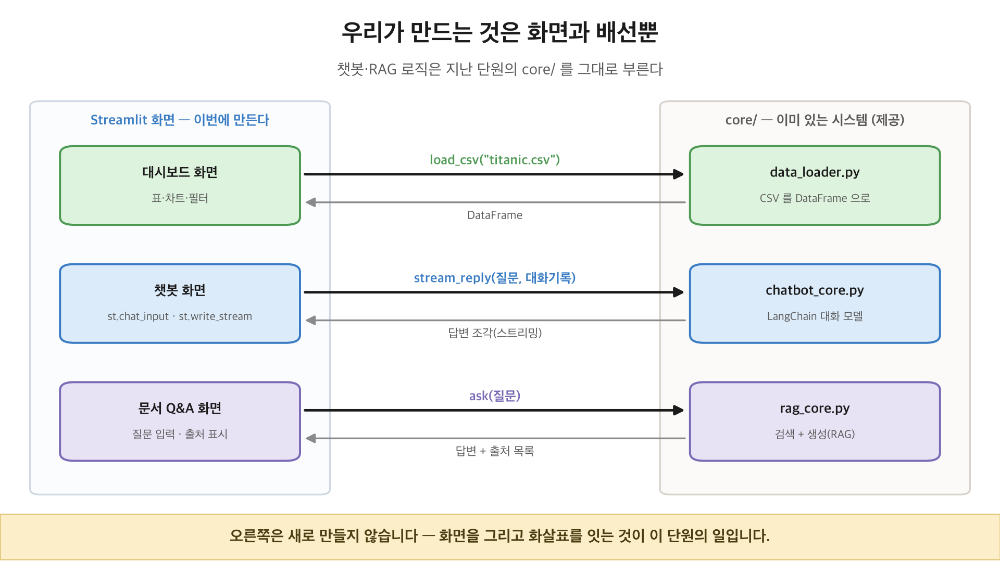

# Streamlit 대화형 AI·데이터 분석 대시보드

Streamlit으로 **데이터 분석 대시보드**와 **대화형 AI(챗봇·문서 Q&A)** 앱을 만들고, 배포까지 익히는 단원입니다.
지난 단원에서 만든 **챗봇·RAG 시스템(`core/`)** 을 UI에 **연동**하는 데 집중합니다. RAG/LLM 로직은 새로 만들지 않습니다.



## 폴더 구성

| 경로 | 내용 |
| --- | --- |
| `교안_01_기초UI/` | 실행형 교안 7강: 시작·데이터표시·입력위젯·레이아웃/차트·상태/캐싱·진행표시/폼·부분재실행 |
| `교안_02_챗봇과_연동/` | 실행형 교안 5강: 채팅요소·챗봇연동·RAG연동·`04_멀티페이지_데모/`·`05_배포.md` |
| `부록_제너레이터_yield.ipynb` | 참고 자료: `yield`·제너레이터가 무엇인지 (챗봇 스트리밍의 바탕) |
| `과제_LV1_기초/` | UI 집중 (타이타닉 대시보드): `app.py` 스켈레톤 + `문제.ipynb` |
| `과제_LV2_응용/` | 기존 챗봇/RAG 연동 (택시 대시보드): `app.py` + `문제.ipynb` |
| `과제_LV3_통합/` | 멀티페이지 통합 (다이아몬드): `main.py` + `pages/` + `문제.ipynb` |
| `정답/` | 과제 정답 완성 앱 (LV1·LV2·LV3) |
| `core/` | **제공 코드**: chatbot_core·rag_core(기존 시스템)·data_loader·fonts |
| `data/` | 실습 데이터 (titanic·taxis·diamonds·penguins·flights·faq_docs) |

## 실행 방법

교안·앱은 모두 `.py` 파일입니다. 루트(`실습자료/`)에서 실행하세요.

```bash
# 교안 (읽고 실행하며 학습)
uv run streamlit run day23_Streamlit_대시보드_챗봇/교안_01_기초UI/01_시작하기.py

# 과제 (스켈레톤을 채운 뒤 실행)
uv run streamlit run day23_Streamlit_대시보드_챗봇/과제_LV1_기초/app.py

# 멀티페이지 앱 (엔트리 파일을 실행)
uv run streamlit run day23_Streamlit_대시보드_챗봇/과제_LV3_통합/main.py
```

## 필요 라이브러리 (직접 설치)

주피터 대신 **Streamlit** 을 씁니다. 루트 프로젝트에 이미 설치돼 있지만, 단독으로 설치한다면:

```bash
uv add streamlit plotly langchain langchain-openai langchain-community langchain-chroma chromadb
# (pandas·matplotlib·seaborn 은 이전 단원에서 설치)
```

배포는 `교안_02_챗봇과_연동/04_멀티페이지_데모/` 폴더를 통째로 올리면 됩니다. 그 안에 `core/`·`data/`·`pyproject.toml`·`uv.lock` 이 함께 들어 있습니다.

## API 키 (필수)

챗봇·문서 Q&A 앱은 **실제 OpenAI 모델**을 호출합니다. 키 없이 도는 대체 응답은 없습니다.

1. `cp .streamlit/secrets.toml.example .streamlit/secrets.toml`
2. `secrets.toml` 을 열어 본인 키를 채웁니다 (발급: https://platform.openai.com/api-keys)
3. 앱을 다시 실행합니다

키가 없으면 해당 앱은 화면에 안내를 띄우고 그 자리에서 멈춥니다(`st.error` + `st.stop`).
데이터 대시보드 앱(교안 01, 과제 LV1)은 LLM 을 쓰지 않으므로 키 없이도 실행됩니다.

## 알아 둘 것

**모든 앱 맨 위의 2줄 (제공 코드)**

```python
import os
os.environ.setdefault("ARROW_DEFAULT_MEMORY_POOL", "system")
```

pandas·Streamlit 이 표를 화면에 보낼 때 쓰는 **Arrow** 의 기본 메모리 할당기(mimalloc)가
macOS 에서 **화면 재실행 시 앱을 죽이는(세그폴트)** 문제가 있습니다(재현: 버튼·채팅 상호작용 시 5/5 크래시).
표준 할당기(system)로 바꾸면 사라집니다(0/5). `pandas` 를 import 하기 **전에** 설정해야 효과가 있으므로
반드시 파일 맨 위에 둡니다. 학생은 건드릴 필요 없습니다.

**챗봇 스트리밍**

`core.chatbot_core.stream_reply()` 는 답변을 조각으로 내보내고, `st.write_stream()` 이 그것을 받아
**한 단어씩 흘러나오게** 그립니다. LangChain 이 실제 모델의 토큰을 그대로 흘려보내므로,
답변이 만들어지는 속도대로 화면에 나타납니다.

## 검증 (강사용)

```bash
uv run python scripts/lint_boundaries.py          # 선행 개념(범위) 검사
uv run python scripts/verify_streamlit_apps.py    # 앱이 예외 없이 렌더되는지(AppTest)
```
